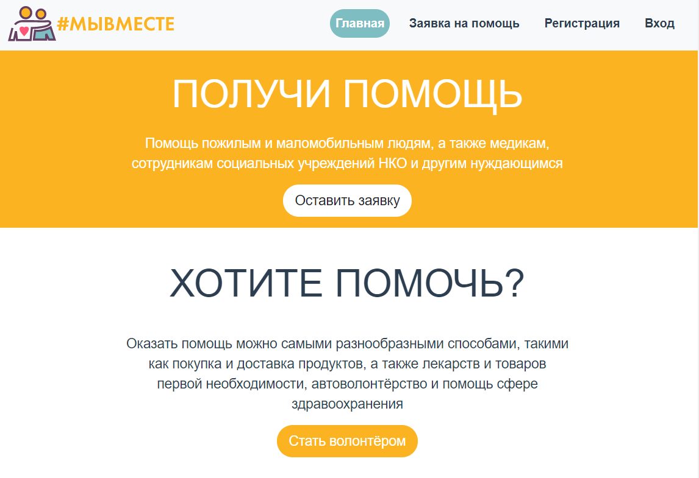
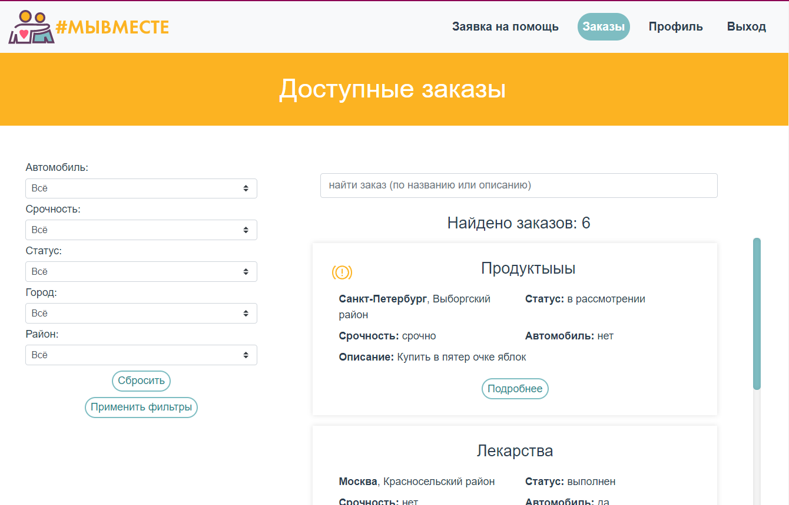

# Веб-сервис для организации волонтёрской деятельности.

### Возможности:
- Регистрация и авторизация пользователей
- Возможность просмотра личного профиля и списка выполненных заказов
- Возмодность добавления, редактирования и просмотра волонтёрских заказов
- Поиск и фильтрация заказов
- Возможность (для волонтёра) принять заказ к выполнению и завершить его
- Добавление отзывов о выполнении волонтёрских заказов
- Просмотр персональных предложений

### Примеры интерфейсов

